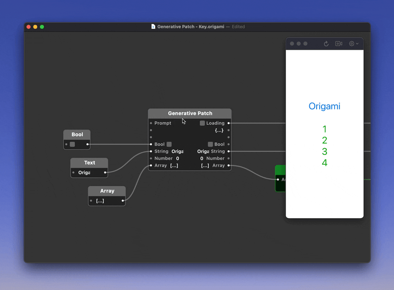

## Origami Generative Patch

Experimental Origami patch that takes a prompt and transforms the inputs in some way. Under the hood the patch makes a `Network Request` to GPT-3.5-Turbo that returns a JavaScript snippet. The snippet gets fed into a separate `JavaScript Patch` that mutates the input and output values.

Make sure to set the API key inside the patch.

The patch has some limitations that make it not feasible to use in day-to-day prototyping.

## Limitations

- **The generated code snippet is not persisted after prototype restarts**
- The OpenAI private API key has to be hard-coded into the patch

## Credits

Credit to [Matthew Mang](https://www.matthewmang.com/) whose Origami-OpenAI-GPT file I forked.
